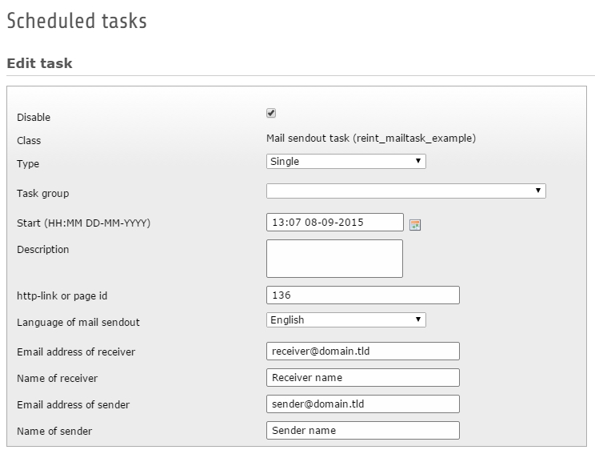

.. ==================================================
.. FOR YOUR INFORMATION
.. --------------------------------------------------
.. -*- coding: utf-8 -*- with BOM.

.. include:: ../Includes.txt

.. _introduction:

Introduction
============

.. _what-it-does:

What does it do?
----------------

This extension shows as example the configuration of a scheduler task with the possibility to send out mails via CLI with rendered FLUID templates in different languages.
It shows also how to use custom ViewHelpers to generate frontend URIs from backend to link to pages in pagetree.

.. _screenshots:

Screenshots
-----------

A screenshot of the scheduler task shows the fields of the task which a user/administrator can define to test.

   Scheduler task in TYPO3 backend

   Here you can see how the scheduler task looks like.
